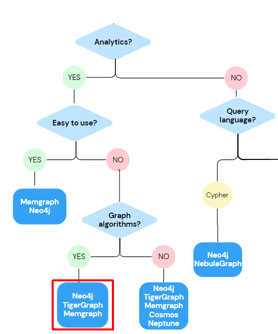
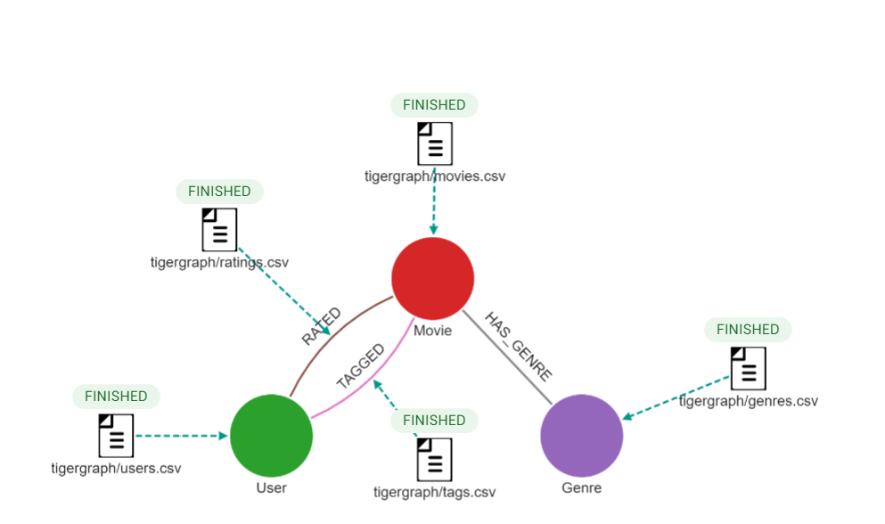

# Master-thesis: Selecting a graph database

## Dataset
This repository contains the tests performed on graph databases for the purposes of the master thesis: "Selecting a graph database".

The tests are a follow-up to the decision model described in the thesis, and evaluate a subset scenario: an LPG graph database that has good performance and graph algorithms support. The corresponding decision model is available on [GitHub](https://github.com/phantomchicken/Graph-database-decision-model).

</img>

**Figure 1:** Evaluated LPG subset.

We used the MovieLens 10M dataset. The data was collected on ```movielens.org```, where users rated movies they had seen on a 1-5 star scale.  The dataset was chosen for its long history of use in recommendation system research, large volume of data, schema comprehensibility and flexibility.  For this example, the 10M variation was used. Users are anonymized and were chosen at random, provided they had rated at least 20 movies. The schema and entity structure can be seen in the figure and table below. 

</img>

**Figure 2:** Schema of the MovieLens dataset.

| **Entity** | **Filename**  | **Count**    | **Attributes**                                      |
|------------|---------------|--------------|-----------------------------------------------------|
| Movie      | movies.csv    | 10,681       | movieId, title, genres                              |
| Genre      | genres.csv    | 18           | name                                                |
| User       | users.csv     | 71,567       | userId                                              |
| Tag        | tags.csv      | 95,580       | tagId, userId, movieId, tag, timestamp              |
| Rating     | ratings.csv   | 10,000,054   | ratingId, userId, movieId, rating, timestamp        |

**Table 1:** Contents of the MovieLens 10M dataset.

## Initial preprocessing

Some initial preprocessing is required before using the dataset. Follow these steps:

1. **Change to the datasets folder:**
    ```bash
    cd datasets
    ```

2. **Run `preprocess.sh`:**
    This script:
    - Checks if the `ml-10M100K` folder exists in the current directory.
    - If not, it downloads, unpacks, and removes unnecessary files.
    - Renames files from `.dat` to `.csv`.
    - Splits `ratings.csv` into 10 equally sized files (for Memgraph).
    - Creates `genres.csv` as defined in the dataset README.md.
    - Creates `users.csv` by extracting unique user IDs from `movies.csv` and `ratings.csv`.
    - Removes quotes from `movies.csv` and `tags.csv`, changes delimiters to:
        - `|` for `tags` and `ratings`
        - `%` for `movies`
    - Prepends header lines to every file.
    - Copies all data files to the TigerGraph Docker container.
    - Copies all data files to the Memgraph Docker container.
    
    ```bash
    ./preprocess.sh
    ```

3. **Run `preprocessneo.sh`:**
    This script:
    - Copies data files to the `neo4j-import` folder.
    - Prepares the headers as required for Neo4j.
    - Copies the files to the Neo4j Docker container.
    
    ```bash
    ./preprocessneo.sh
    ```


## Neo4j
To test in Neo4j, follow these steps:

1. **Start the Docker container:**
From the root folder use docker-compose up to start the Neo4j image.
   ```bash
   docker-compose up
   ```
2. **Change to the Neo4j folder:**
   ```bash
   cd neo4j
   ```
3. **Open the shell of the Neo4j Docker container**
   ```bash
   docker exec -it neo4j sh
   ```
4. **Run the neo4j-admin database import tool**
   Be sure that you ran the initial preprocessing first (`./preprocess.sh` and `./preprocessneo.sh`). Alternatively you can modify `movielens.py` and import through transactions but at a much slower pace.
   ```bash
   neo4j-admin database import full --delimiter="%" \
    --nodes=Movie="/var/lib/neo4j/import/movies.csv" \
    --nodes=User="/var/lib/neo4j/import/users.csv" \
    --nodes=Genre="/var/lib/neo4j/import/genres.csv" \
    --relationships=HAS_GENRE="/var/lib/neo4j/import/movie_genre_edges.csv" \
    --relationships=TAGGED="/var/lib/neo4j/import/tags.csv" \
    --relationships=RATED="/var/lib/neo4j/import/ratings.csv" \
    --overwrite-destination=true \
    --verbose=true
   ```
5. **Run `testbash.sh` to execute a query and monitor performance:**
   ```bash
   ./testbash.sh
   ```

   This script runs the Python script `test.py` x 30 times. The Python script:
   - Connects to Neo4j.
   - Executes a query to analyze the dataset.
   - Monitors performance using Docker stats for CPU and memory usage.
   - Records the results in `res.csv `. The first column represents time (s), the second represents CPU usage (%) and the third represents memory usage (GB).

Queries are defined in queriesneo4j.cyp. The current query to be tested is defined in the query variable in `test.py`:
```
# Sample Query (adjust as needed)
query = """
// Q1: Find all the movies in a specific genre (e.g., Action): 300ms
MATCH (m:Movie)-[:HAS_GENRE]->(g:Genre {name: "Action"}) 
RETURN m.title;
"""
```

## Memgraph
To test in Memgraph, follow these steps:

1. **Change to the Memgraph folder:**
   ```bash
   cd memgraph
   ```

2. **Run the `memgraph.sh` script to start Memgraph and configure settings:**
   ```bash
   ./memgraph.sh
   ```

   This script:
   - Sets up `vm.max_map_count` for Memgraph using a Docker container.
   - Starts the Memgraph container and checks if it is already running.
   - Copies the dataset files to the container.

3. **Run `movielens.py` to load the data into Memgraph:**
   ```bash
   python movielens.py
   ```

   This script:
   - Connects to Memgraph.
   - Loads the necessary CSV files (movies, ratings, genres, tags, etc.) into the database.
   - Times the import process and prints the total time.

4. **Run `testbash.sh` to execute a query and monitor performance:**
   ```bash
   ./testbash.sh
   ```

   This script runs the Python script `test.py` x 30 times. The Python script:
   - Connects to Memgraph.
   - Executes a query to analyze the dataset.
   - Monitors performance using Docker stats for CPU and memory usage.
   - Records the results in `res.csv `.  The first column represents time (s), the second represents CPU usage (%) and the third represents memory usage (GB).

Queries are defined in queriesmemgraph.cyp. The current query to be tested is defined in the query variable in `test.py`:
```
# Sample Query (adjust as needed)
query = """
MATCH (m:Movie)-[:HAS_GENRE]->(g:Genre {name: "Action"}) 
RETURN m.title;
"""
```


## TigerGraph
To test in TigerGraph, you should first register for the free license on their [website](https://info.tigergraph.com/enterprise-free). This grants you a license key you will later set. Follow these steps:

1. **Run the TigerGraph container:**
   ```bash
   docker run -d -p 14022:22 -p 9000:9000 -p 14240:14240 --name tigergraph --ulimit nofile=1000000:1000000 -t tigergraph/tigergraph:latest
   ```

2. **Access the container:**
   ```bash
   docker exec -it tigergraph sh
   ```

3. **Start all TigerGraph services:**
   ```bash
   gadmin start all
   ```

4. **Set up your license key (free version) on TigerGraph’s website:**

   ```bash
   gadmin license set <key>
   gadmin config apply
   gadmin license status
   ```

5. **Create the schema by running the following commands:**
   ```bash
   docker exec tigergraph //home/tigergraph/tigergraph/app/4.1.0/cmd/gsql "CREATE VERTEX User (PRIMARY_ID id UINT)"
   docker exec tigergraph //home/tigergraph/tigergraph/app/4.1.0/cmd/gsql "CREATE VERTEX Movie (PRIMARY_ID id UINT, title STRING)"
   docker exec tigergraph //home/tigergraph/tigergraph/app/4.1.0/cmd/gsql "CREATE VERTEX Genre (PRIMARY_ID name STRING)"
   docker exec tigergraph //home/tigergraph/tigergraph/app/4.1.0/cmd/gsql "CREATE UNDIRECTED EDGE RATED (FROM User, TO Movie, rating DOUBLE, timestamp UINT)"
   docker exec tigergraph //home/tigergraph/tigergraph/app/4.1.0/cmd/gsql "CREATE UNDIRECTED EDGE TAGGED (FROM User, TO Movie, tag STRING, timestamp UINT)"
   docker exec tigergraph //home/tigergraph/tigergraph/app/4.1.0/cmd/gsql "CREATE UNDIRECTED EDGE HAS_GENRE (FROM Movie, TO Genre)"
   docker exec tigergraph //home/tigergraph/tigergraph/app/4.1.0/cmd/gsql "CREATE GRAPH movielens(User, Movie, Genre, RATED, TAGGED, HAS_GENRE)"
   docker exec tigergraph //home/tigergraph/tigergraph/app/4.1.0/cmd/gsql "INSTALL DATASET"
   ```

4. **Run `testbash.sh` to execute a query and monitor performance:**
   ```bash
   ./testbash.sh
   ```

   This script runs the Python script `test.py` x 30 times. The Python script:
   - Connects to TigerGraph.
   - Executes a query to analyze the dataset.
   - Monitors performance using Docker stats for CPU and memory usage.
   - Records the results in `res.csv `. The first column represents time (s), the second represents CPU usage (%) and the third represents memory usage (GB).

Queries are defined in queriestigergraph.gsql. The current query to be tested is defined in the query variable in `test.py`:
```
# Sample Query (adjust as needed)
query = """
INTERPRET QUERY () FOR GRAPH movielenss {
    Movies = SELECT m
        FROM Movie:m -(HAS_GENRE)-> Genre:g
        WHERE g.name == "Action";

    PRINT Movies [Movies.title];
}
"""
```
